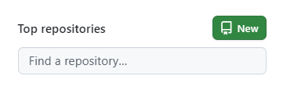
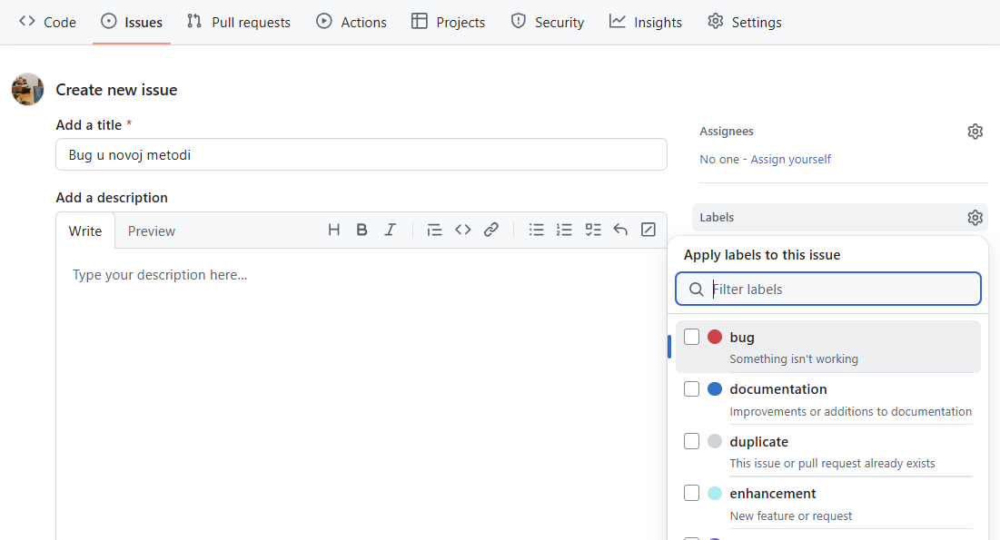

# VJEŽBA 1 - korištenje Git alata za kontrolu verzije koda 

## Registacija na Github i instaliranje Git-a

1. **Registracija na GitHub-u**:
   - otvorite GitHub stranicu (https://github.com/)
   - ukoliko već nemate račun, registrirajte se upisujući željeno korisničko ime, e-mail adresu i šifru
   - kliknite **"Sign up"** i pratite upute 

2. **Provjera Git instalacije**:
   - otvorite Command Prompt (cmd) ili PowerShell
   - utipkajte naredbu:
        ```bash
        git --version
        ```
   - ako je Git već instaliran, prikazat će se njegova verzija ✅
   - uklonite certifikate prethodnih korisnika sljedećom naredbom:
      ```
         cmdkey /delete:git:https://github.com
      ```

3. **Instalacija Gita** (ako nije instaliran):
   - za Windows: Preuzmite i instalirajte s https://git-scm.com/downloads/win
   - tijekom instalacije prihvatite predložene standardne opcije

<br/><br/>
## Kreiranje projekta i povezivanje s GitHub-om

4. **Stvaranje repozitorija na GitHubu**:
   - nakon prijave na GitHub, kliknite na **"+"** u gornjem desnom kutu i odaberite **"New repository"** ili klikom na **"New"** u pregledniku repozitorija (lijevo)
   - unesite ime repozitorija (npr. "PIS-Vjezba1")
   - dodajte opis projekta (opcionalno)
   - ostavite **javni pristup** (ne označavajte "Private")
   - **ne uključujte** druge ponuđene opcije (README, .gitignore, license)
   - kliknite **"Create repository"**

        
<br/><br/>
5. **Kreiranje lokalnog Python projekta**:
   - otvorite Command Prompt
   - kreirajte novi direktorij za projekt:
        ```bash
        mkdir PIS-V1
        ```
   - pozicionirajte se u taj direktorij:
        ```bash
        cd PIS-V1
        ```
   - inicijalizirajte Git repozitorij:
        ```bash
        git init
        ```
   - otvorite folder u VS Codeu:
        ```bash
        code .
        ```
<br/><br/>


6. **Uređivanje datoteka u VSCode**:
    - kreirajte novu Python datoteku desni klikom na **File Explorer** -> **New File**
    - nazovite datoteku ``main.py``

        ```python
        def main():
            print("Hello world!")

        if __name__ == "__main__":
            main()
        ```
   - na isti način kreirajte datoteku `README.md` i dodajte osnovni opis projekta:
        ```markdown
        # PIS-Vjezba1
        
        Python projekt za vježbu korištenja Git sustava za verzioniranje.
        ```
   - spremite obje datoteke ``Ctrl+S``
<br/><br/><br/>

7. **Povezivanje lokalnog i GitHub repozitorija**:
   - konfigurirajte Git korisničke podatke (ako već niste):
        ```bash
        git config user.name "VašeGithubKorisničkoIme"
        ```
        ```bash
        git config user.email "vaš.email.sa.githuba@primjer.com"
        ```
   - dodajte stvorene datoteke u **stage** Git indeks:
        ```bash
        git add .
        ```
   - napravite inicijalni commit:
        ```bash
        git commit -m "feat: main i readme"
        ```
   <br/><br/>
   - povežite s **GitHub repozitorijem** (zamijenite s vašim korisničkim imenom):
        ```bash 
        git branch -M main
        ```
        ```bash 
        git remote add origin https://github.com/VašeKorisničkoIme/PIS-Vjezba1.git
        ```
   - pošaljite lokalne promjene na GitHub:
        ```bash 
        git push -u origin main
        ```
   - provjerite GitHub web sučelje da vidite jesu li vaše datoteke uspješno prenesene ✅


<br/><br/>
## Korištenje Git verzioniranja

8. **Modifikacija projekta**:
   - otvorite `main.py` u VSCode i dodajte novu funkciju:
        ```py
        def nova_funkcija():
            return "Ovo je nova funkcija."
        ```
   - spremite datoteku ``Ctrl+S``
   - u Command Promptu **usporedite promjene**:
        ```shell
        git diff
        ```
    - dodajte promjene u područje postavljanja:
        ```bash 
        git add main.py
        ```
    - napravite novi commit:
        ```bash 
        git commit -m "feat: nova funkcija"
        ```
    - pošaljite promjene na GitHub:
        ```
        git push
        ```
   - provjerite GitHub web stranicu repozitorija
<br/><br/><br/>

9. **Suradnja**:
   - dodajte novog suradnika:
     - na GitHub stranici repozitorija, kliknite **"⚙️ Settings"**
     - izaberite **"👤 Collaborators"** iz lijevog izbornika
     - kliknite **"Add people"** i unesite korisničko ime kolege

   - suradnik prihvaća poziv (link u e-mailu ili pretincu obavijesti GitHuba)
   - suradnik modificira projekt (projekt na koji je pozvan, ne svoj ⚠️) putem GitHub web sučelja:
     - otvaranjem `main.py`
     - klikom na **"✏️ (Edit this file)** u gornjem desnom kutu"
     - dodavanjem novog koda ili komentara
        ```py
        # Ovo je moj komentar - VašeIme
        ```
     - spremanjem promjene s opisom klikom na **"Commit changes"**

         
<br/><br/><br/>

10. **Dohvaćanje promjena**:
    - u terminalu **dohvatite** (bez primjene istih) zadnje promjene s GitHub-a:
        ```bash
        git fetch
        ```
    - pregledajte razlike u odnosu na remote main granu:
        ```bash 
        git diff main origin/main
        ```
    - **dohvatite i primjenite** promjene ⬇️:
        ```bash 
        git pull
        ```
    - pogledajte tko je napravio koje promjene na  `main.py`:
        ```bash
        git blame main.py
        ```
<br/><br/>

11. **Upravljanje konfliktima**:
    - modificirajte `main.py` u VSCode, dodajte novu metodu:
        ```python
        def nova_metoda(self):
            return "Ovo je nova metoda"
        ```
    - u terminalu **stage**-ajte promjenu:
        ```bash
        git add main.py
        ```
    - napravite commit:
        ```bash
        git commit -m "feat: dodana nova metoda"
        ```
    - 🚨🚨🚨 **NE RADITE PUSH!** 🚨🚨🚨

    - kolaborator modificira **istu (vašu) datoteku** preko GitHub web sučelja, dodajući drugu metodu na istom mjestu
        ```py
        def nova_metoda():
            return "Ovo je nova metoda 2."
        ```
    - u terminalu dohavtite kolaboratorove promjene:
        ```bash
        git fetch
        ```
    - pregledajte razlike:
        ```bash
        git diff main origin/main
        ```
    - pokušajte **primjeniti dohvaćene promjene**:
        ```
        git pull
        ```
    - Git će javiti **konflikt** ⚠️⚠️
    - otvorite `main.py` u VSCode i riješite konflikt (bit će označen s `<<<<<<<`, `=======`, `>>>>>>>`) klikom na jednu od opcija za **merge**
    - nakon rješavanja konflikta stage-ajte promjene:
        ```bash
        git add main.py
        ```
    - commit s opisom **merge-a**:
        ```bash
        git commit -m "fix: riješen konflikt"
        ```
    - pošaljite promjene na GitHub repo:
        ```
        git push
        ```
<br/><br/>

13. **Korištenje GitHub Issues**:
    - kao suradnik otvorite GitHub projekt na kojem surađujete (**ne vaš**)
    - kliknite na **"Issues"** (gore lijevo) -> **"New issue"**

        

    - opišite "bug" i označite ga kao bug (s desne strane)

        

    - kao vlasnik otvorite svoj GitHub projekt, pregledajte stvoreni issue
      - dodijelite ga osobi koja ga je prijavila (s desne strane **"Assignees"**)
      - napravite ispravak - **ne raditi**⚠️⚠️
      - napišite da je bug ispravljen
      - kliknite **"Comment and Close"** ✅
<br/><br/>

## Izvještaj vježbe

14. **Dokumentiranje**:
    - napravite screenshot vašeg GitHub projekta ``Windows  + Shift + S``
    - zamijenite "Slika 1" u **Word** dokumentu sa svojim screenshotom
    - zamijenite primjer linka s linkom na vaš projekt
    - uploadajte popunjeni **Word** dokument na  portal
